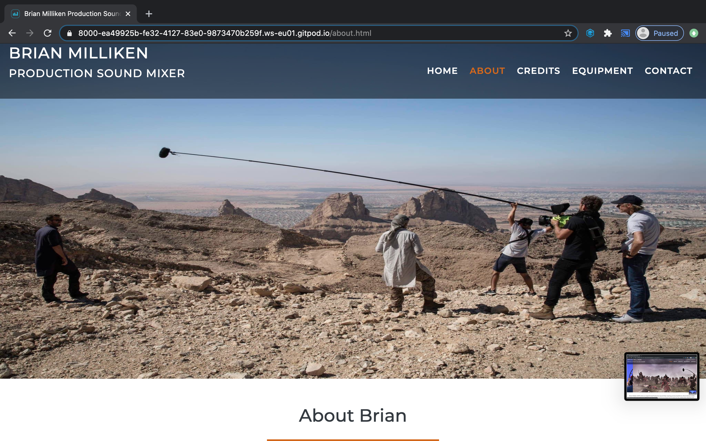
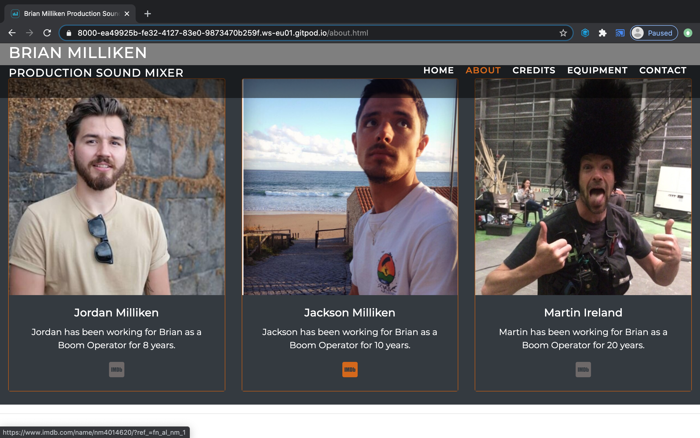
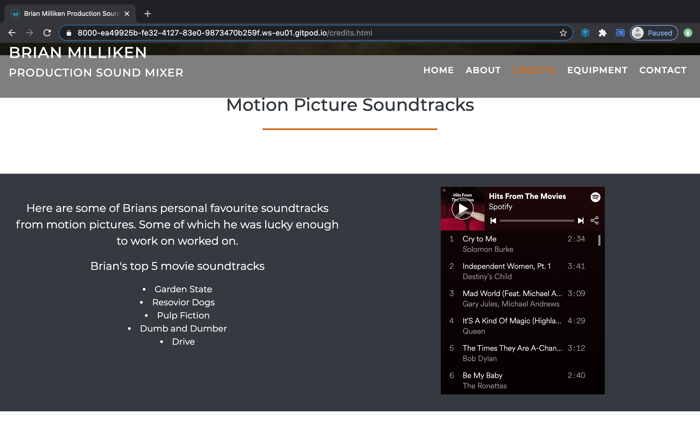
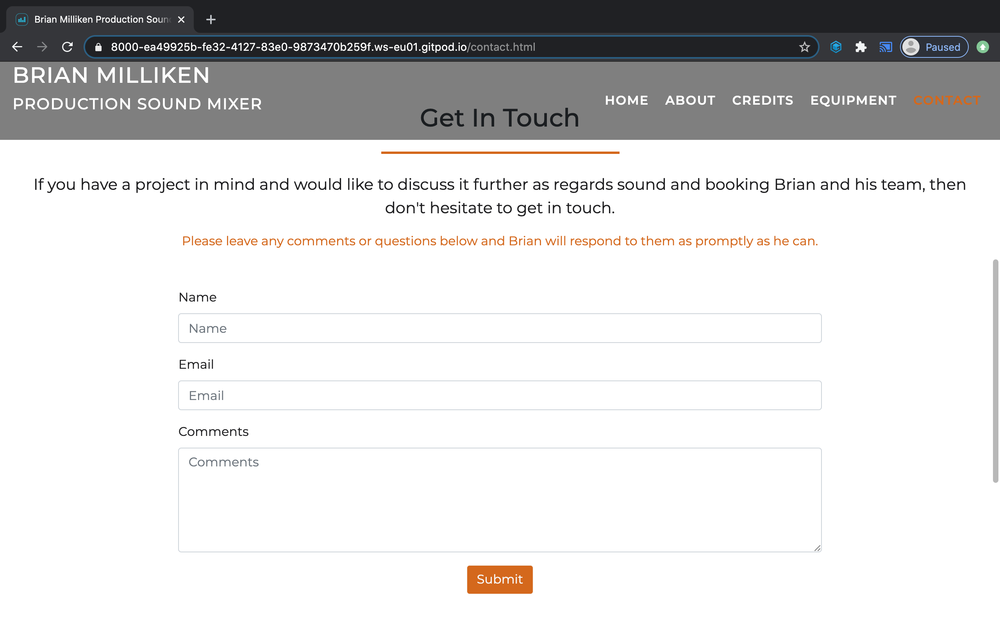
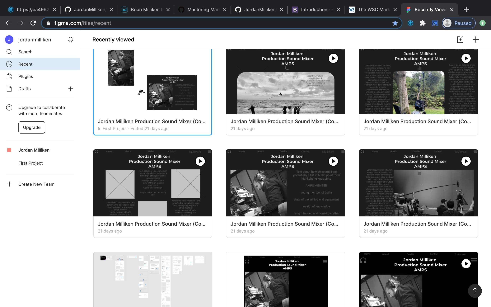
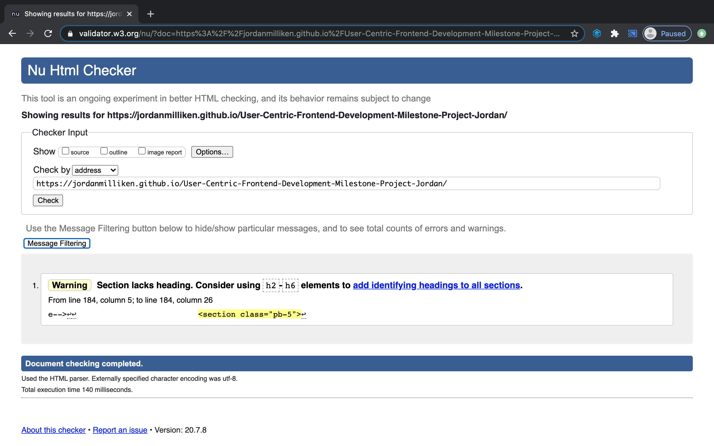
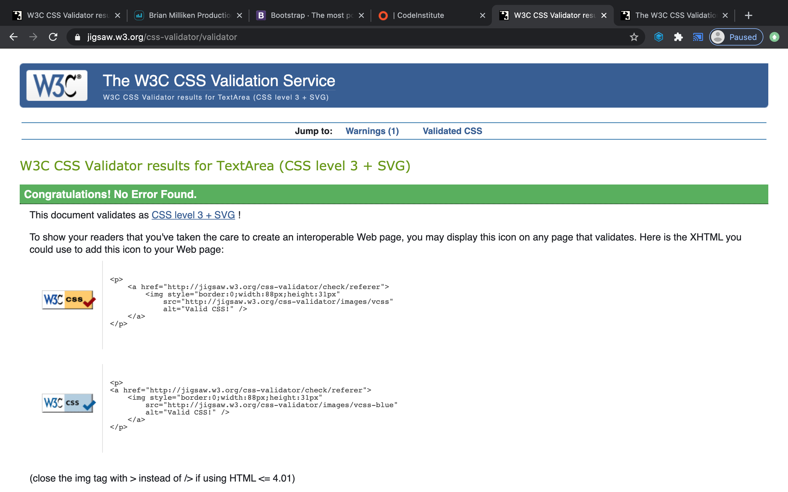

# Milestone Project 1

[Live website.](https://jordanmilliken.github.io/User-Centric-Frontend-Development-Milestone-Project-Jordan/)
 

- This responsive website was created for Brian Milliken Production Sound Mixer, Brian is a real Sound mixer and works on many large scale productions. 
- This project was created as my Milestone 1 Project for Code Institute's Full Stack Software Development Program.
- This website was built with HTML, CSS & Bootstrap.
- Brian’s website showcases all of Brians attributes and characteristics in a sleek and user-friendly manner.

The website's Carousel and jumbotron is consistent and engaging throughout all of the websites pages. The website includes a Home page with image carousel that draws the user in. An About page which is the main goal of the site to sell Brian. An equipment page where users can easily see what Brian is working with without too much text. A fun credits page with a spotify playlist embedded encouraging users to stay longer and listen to music whilst reading Brians Credits. And finally a contact page where users can get in touch and potentially book Brian for the next Job

 
## UX

## Wireframes

I used Figma (https://www.figma.com/files/recent) for my wireframes which i spent a week mocking up with images and content.

## Features

- Spotify Playlist.
- Responsive on all devices screen sizes.
- Multiple interactive Features.

### Features Left to Implement
- In the future i would like to hone my new found slills of Javascript. I would also like to make this website live and obtain the domain name for it.

## Technologies Used
### Languages Used
-   [HTML5](https://en.wikipedia.org/wiki/HTML5)
-   [CSS3](https://en.wikipedia.org/wiki/Cascading_Style_Sheets)
### Frameworks, Libraries & Programs Used
1. [Bootstrap 4.5:](https://getbootstrap.com/docs/4.5/getting-started/introduction/)
    - Bootstrap was used to assist with the responsiveness and styling of the website.
1. [Google Fonts:](https://fonts.google.com/)
    - Google fonts used were "Monserrat" and "Roboto".
1. [Font Awesome:](https://fontawesome.com/) 
    - Font awesome was used for my social media icons and a headphone icon in the footer.

## Testing
The websites HTML and CSS were tested multiple times during the project using [W3 VALIDATOR] (https://validator.w3.org/)
- HTML result 

- CSS result 

- The website was displayed on a wide array of practical devices during testing by myself and by my friends and family. 
- I also used Dev Tools Various screen sizes to check responsiveness of the site.
- I have checked that all internal links are working and that there are no broken links.

## Deployment
-   The project was deployed to GitHub Pages.
-  [This is a link to the GitHub Repository](https://github.com/JordanMilliken/User-Centric-Frontend-Development-Milestone-Project-Jordan)

## Credits
- Bootstrap 4 Bootstrap Documentation Used throught this project. Documentation used: Grid Layout, Cards ,Buttons, Carousel, Navbar,Contact form.
### Content
- All text written by the Jordan Milliken.
### Media
- The photos used in this site were obtained from Jordan Milliken's own personal behind the scenes photo collection and resized using Canva.
- The equipment page Jumbotron Image was sourced from shutterstock.
- The images of the icons on the equipment page were sourced from Zaxcom.com with permission.
- The videos on the equipment page were sourced from Youtube.
- The icons on the footer of every page were sourced from Fontawesome.
- The Favicon was also sourced from Zaxcom.com with permission.
- Playlist from Spotify 

### Acknowledgements
- My mentor who has been a fantastic support
- Tutor support 
- I received inspiration from my 10 years working in film and televison production.
- I received inspiration for this project from Code Institues lessons.
- I received inspiration from Slack Overflow
- I received inspiration from Bootstrap's library.
- I received inspiration from Various bootstrap tutorials and design tutorials on Youtube.
- I received inspiration from Ozone coffee roasters https://ozonecoffee.co.uk/?v=79cba1185463 .
- I received inspiration from https://kaleidografik.com/ as i find their web design stunning so i tried to draw some inspiration and creativity from their sites.